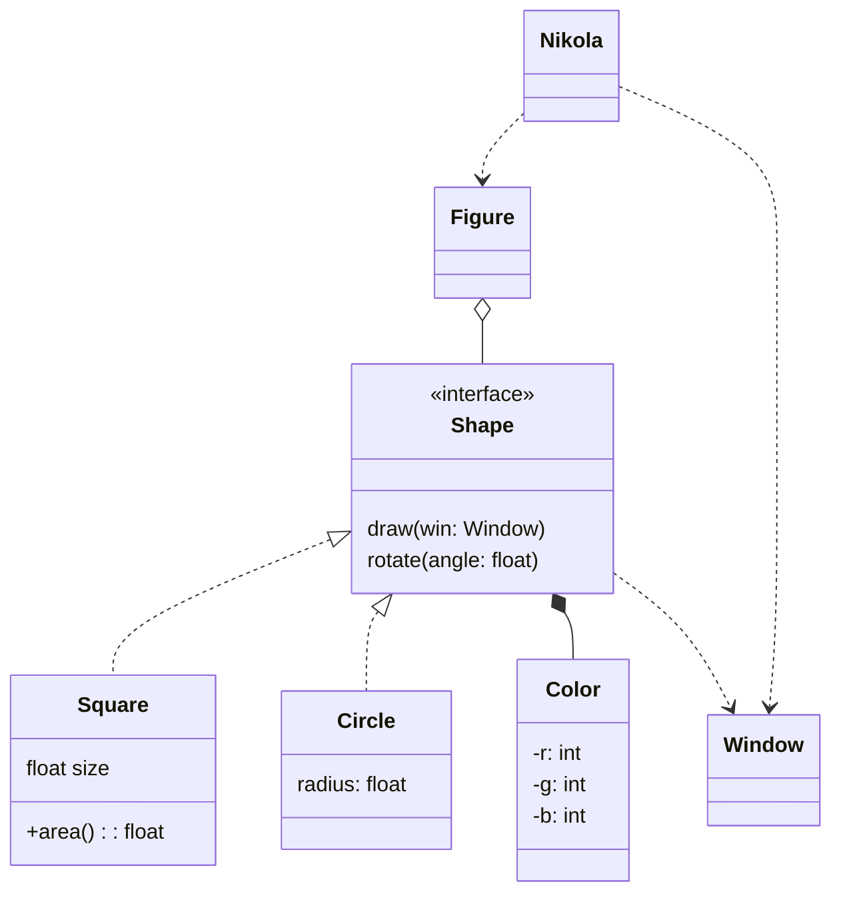

```mermaid
classDiagram
    class Shape {
        <<interface>>
        draw(win: Window)
        rotate(angle: float)
    }

    class Square {
        float size
        +area() : float
    }

    class Circle {
        radius: float
    }

    class Figure {
    }

    class Color {
        -r: int
        -g: int
        -b: int
    }

    class Window {
    }

    class Nikola {
    }

    Shape <|.. Square
    Shape <|.. Circle
    Figure o-- Shape
    Shape *-- Color
    Shape ..> Window
    Nikola ..> Figure
    Nikola ..> Window
```
